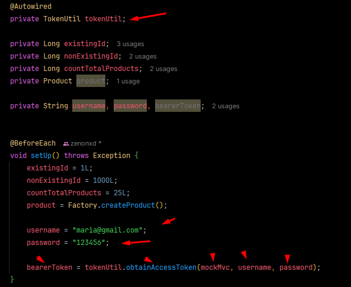

<p align="center">
  
</p>

# Competências

- Modelo de dados de usuários e perfis
- Validação com Bean Validation
  - Annotations
  - Customizando a resposta HTTP
  - Validações personalizadas com acesso a banco
- Login e controle de acesso
  - Spring Security
  - OAuth 2.0
  - Token JWT
  - Autorização de rotas por perfil

# Tópicos


# Objetivo

Essa sessão por sua vez pode ser um pouco repetiviva pelo que já aprendemos no Spring Professional, mas rever nunca é
demais, correto?

# UML


## Implementando User e Role

De sempre, só inserir as entidades e seus atributos.

Como o User para role é direcional, somente o User terá um Set de Roles (roles não terá user importado).

## Mapeamento objeto-relacional + seed banco

Fazer o mapeamento padrão ManyToMany com a tabela de associação e fazer o seed do banco:

```mysql
INSERT INTO tb_user (first_name, last_name, email, password) VALUES ('Alex', 'Brown', 'alex@gmail.com', '$2a$10$eACCYoNOHEqXve8aIWT8Nu3PkMXWBaOxJ9aORUYzfMQCbVBIhZ8tG');
INSERT INTO tb_user (first_name, last_name, email, password) VALUES ('Maria', 'Green', 'maria@gmail.com', '$2a$10$eACCYoNOHEqXve8aIWT8Nu3PkMXWBaOxJ9aORUYzfMQCbVBIhZ8tG');

INSERT INTO tb_role (authority) VALUES ('ROLE_OPERATOR');
INSERT INTO tb_role (authority) VALUES ('ROLE_ADMIN');

INSERT INTO tb_user_role (user_id, role_id) VALUES (1, 1);
INSERT INTO tb_user_role (user_id, role_id) VALUES (2, 1);
INSERT INTO tb_user_role (user_id, role_id) VALUES (2, 2);
```

## CRUD Users

Criar repository, service e controller de User e fazer as subtituições necessárias.

E para dar o encode na senha? Usaremos o BCrypt.

1. Criar um UserInsertDto, ele herdará (extends UserDTO)
2. Ela terá uma String password (getter e setter)

^ Usar dentro do insert do UserService.

Aproveitar pra inserir SpringSecurity, OAuth2 (server/resource) e implementar as interfaces advindas do mesmo.

Qualquer dúvida, veja os meus estudos [aqui](https://olavo-moreira.gitbook.io/studies/v/login-e-controle-de-acesso/inserindo-oauth2-e-jwt-em-um-projeto)

Criar endpoints!

## Bean Validation

Fazer as anotações nos DTOS (notnull, notempty, positive, etc.).

Para que as anotações funcionem, nos endpoints do controller colocar @Valid.

Porém, ao realizar essas anotações e fazer a requisição no Postman, ela não irá passar e no console teremos uma mensagem
de erro.

Devemos ler essa mensagem e tratar a exceção, voltando um JSON customizado com a mensagem, veja:

## Tratamento Exception

Nós iremos utilizar o ResourceExceptionHandler (o que retorna no Postman conforme tinhamos feito no outro projeto).

Só tem uma coisa, e se for mais de um erro? 

Para isso, usaremos a propriedade "e". Ela possui varios atributos tais como: getBindingResult, onde dentro dela,
podemos resgatar "getFieldErrors", uma lista de erros (que é onde colocaremos os nossos).

Criaremos um for para percorrer essa lista (esses FieldErros) e tratálos!

Além disso, criaremos uma classe auxiliar dentro de Exceptions do controller: FieldMessage.


E para completar, criaremos um Objeto de erro (ainda dentro do mesmo pacote), que terá TUDO que o StandError tem + uma 
lista de field message.


O fieldName é o campo que está erro: price, name ou whatever.

Agora no ExceptionHandler muda. O retorno não é mais StandartError e sim ValidationError (criado acima).


Novo retorno do Postman passando um preço e nome inválido:


## Criando Annotations de Validação! ConstraintValidator customizado

Como aproveitar o Bean Validation para que ele tambem verifique condições mais complexas acessando o banco de dados?

Usaremos o ConstraintValidator.

Criaremos uma @interface e um Validator (implementando ConstrantValidator):

Criar as duas no pacote service (subpacote validation).

### Annotation

```java
import java.lang.annotation.ElementType;
import java.lang.annotation.Retention;
import java.lang.annotation.RetentionPolicy;
import java.lang.annotation.Target;

import jakarta.validation.Constraint;
import jakarta.validation.Payload;

@Constraint(validatedBy = UserInsertValidator.class)
@Target({ ElementType.TYPE })
@Retention(RetentionPolicy.RUNTIME)

public @interface UserInsertValid {
	String message() default "Validation error";

	Class<?>[] groups() default {};

	Class<? extends Payload>[] payload() default {};
}
```

### Validator

Initiliaze - Colocamos alguma lógica quando for inicializar o objeto, neste caso, ficará em branco.

isValid - Testerá se o objeto UserInsertDTO será valido ou não (retorna boolean).

```java
import java.util.ArrayList;
import java.util.List;

import jakarta.validation.ConstraintValidator;
import jakarta.validation.ConstraintValidatorContext;

import org.springframework.beans.factory.annotation.Autowired;

import com.devsuperior.dscatalog.dto.UserInsertDTO;
import com.devsuperior.dscatalog.entities.User;
import com.devsuperior.dscatalog.repositories.UserRepository;
import com.devsuperior.dscatalog.resources.exceptions.FieldMessage;

//aqui falamos que o UserInsertDTO receberá a anotation @UserInsertValid
public class UserInsertValidator implements ConstraintValidator<UserInsertValid, UserInsertDTO> {
	
	@Override
	public void initialize(UserInsertValid ann) {
	}

	@Override
	public boolean isValid(UserInsertDTO dto, ConstraintValidatorContext context) {
		
		List<FieldMessage> list = new ArrayList<>();
		
		// Coloque aqui seus testes de validação, acrescentando objetos FieldMessage à lista
		
        // pode colocar até um if por exemplo: if (x coisa for true) vai na list e insere um field
        // message nela.

        //exemplo: vendo se já existe email
        //importar UserRepository
        //criar findByEmail no UserRepository
  
        User user = repository.findByEmail(dto.getEmail());
  
        if (user != null) {
          list.add(new FieldMessage("email", "Email já existe"));
        }
      
      
		for (FieldMessage e : list) {
			context.disableDefaultConstraintViolation();
			context.buildConstraintViolationWithTemplate(e.getMessage()).addPropertyNode(e.getFieldName())
					.addConstraintViolation();
		}
        //verifica se ela está vazia
        // se estiver vazia, quer dizer que nenhum dos testes acima entrou nela (ou seja, n deu nenhum erro).
		return list.isEmpty();
	}
}
```

Agora vamos ao UserInsertDTO e passamos o @UserInsertValid. Essa anotação por de baixo dos panos verificará se o email
inserido já existe no banco.

## Validando Update de Usuário - UserUpdateValidator

### Refatoração

Imagine dar um update no email do usuario 2 (maria), passando o email do alex. Vai estourar um erro 500.

É um email repetido, então ele pega a restrição de dado do e-mail repetido. Mas não é para dar 500 e sim um erro 402
bonitinho falando o e-mail já está sendo usado.

Criaremos uma validação atualizada para o update.

1. Usaremos o UserInsertValid e criar um UserUpdateValid.
2. Usaremos o UserUpdateValid e criar um UserUpdateValiator.

Probleminha: Sabemos que o UserInsertDTO extende a classe UserDTO. Se usarmos essa anotação criada no UserDTO ele também 
irá herdar essa anotação, e não é o ideal. **O UserDTO não terá NENHUMA anotação de validação.**

Criaremos um UserUpdateDTO (usando UserInsertDTO como base). Não terá nada em seu corpo, pois já extende o UserDTO.


Lembrar de alterar o método do controller para UserUpdateDTO:


Service também:


### UserUpdateValidator

Vamos pegar a nossa classe UserUpdateValidator e fazer as devidas alterações.

Sabemos que no update passamos o ID na URL para atualizar. Então acessaremos o ID dentro do validator.

Injetaremos HttpServletRequest com AutoWired (ele guardará as informações da requisição), usaremos ele para pegar o
código, veja:


## Preparando projeto para Segurança (Security + OAuth2)

[Repositório de referencia](https://github.com/devsuperior/spring-boot-oauth2-jwt-demo/tree/main/password-grant)

## Implementando checklist Spring Security

Implementar as interfaces (UserDetails, GrantedAuthority, UserDetailsService e UsernameNotFoundException).

[Seguir tudo daqui](https://olavo-moreira.gitbook.io/studies/v/login-e-controle-de-acesso/inserindo-oauth2-e-jwt-em-um-projeto/springsecurity-interfaces)

## OAuth2 e JWT

[Visão geral OAuth2 (Teórica)](https://olavo-moreira.gitbook.io/studies/v/login-e-controle-de-acesso/visao-geral-oauth2)

[Inserindo OAuth2 e JWT no projeto](https://olavo-moreira.gitbook.io/studies/v/login-e-controle-de-acesso/inserindo-oauth2-e-jwt-em-um-projeto/oauth2-jwt-password-grant)

## Requisição de Login

[Veja aqui](https://olavo-moreira.gitbook.io/studies/v/login-e-controle-de-acesso/postman/requisicao-de-login)

## Melhorando postman

Criando ambiente, referenciando variáveis, etc.

[Veja aqui](https://olavo-moreira.gitbook.io/studies/v/login-e-controle-de-acesso/postman)

## Controle de acesso

Passar nos endpoints

```.java
@PreAuthorize("hasRole('ROLE_ADMIN')")

@PreAuthorize("hasAnyRole('ROLE_ADMIN', 'ROLE_OPERATOR')")
```

## Teste camada web unidade (tirando filtro de Role)

Para que os testes da camada web passem não usando os filtros de roles do Controller, faremos o seguinte.

No nome da classe, passar:

```.java
@WebMvcTest(value = ProductController.class, excludeAutoConfiguration = {SecurityAutoConfiguration.class})
```

## Teste camada web integração

Geraremos um token valido e iremos inserir na requisição (dentro do perform), veja:

Criaremos uma classe chamada TokenUtil. Essa classe irá criar um token válido usando MockMvc, ele será retornado em
String.

Veja a classe [aqui](https://gist.github.com/acenelio/814230a96e0bf8f4fb0d96bd044e9d64)

Para implementar ela no nosso teste de ingração do Controller é muito fácil.

1. Injetar o TokenUtil;
2. Criar 3 variáveis do tipo String: username, password, bearerToken;
3. Iniciar elas no setUp com os dados:



Agora dentro dos métodos que precisarem do Token, passar a variável na header, veja:


